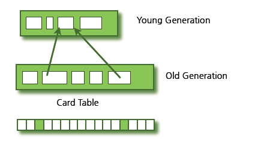
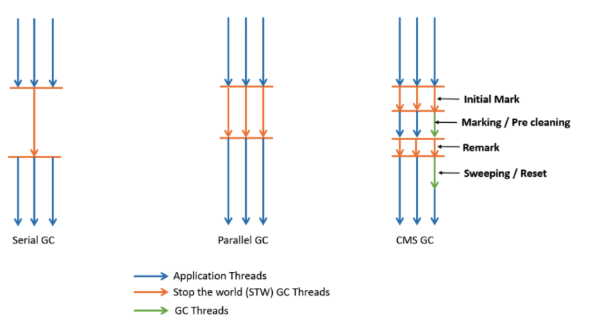
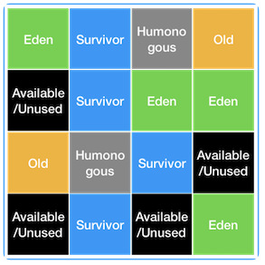

## 가비지 컬렉션

### 1. 가비지 컬렉션이란?
- 동적 할당된 메모리 영역 가운데 더 이상 사용할 수 없게 된 영역을 해제하는 기능
- 더 이상 사용할 수 없게 된 영역이란 어떠한 변수도 가리키지 않게 된 영역이다

### 2. 가비지 컬렉션의 장단점
#### 장점
아래의 3가지 버그를 줄이거나 막을 수 있다.
- 유효하지 않은 포인터 접근: 이미 해제된 메모리에 접근하는 버그. 만약 이 포인터가 해제되고 새로운 값이 할당되었다면, 잘못된 값을 읽어오게 된다.
- 이중 해제 : 이미 해제된 메모리를 또다시 해제하는 버그
- 메모리 누수 : 더이상 필요하지 않은 메모리가 해제되지 않고 남아있는 버그

#### 단점
- 어떤 메모리를 해제할지 결정하는데 비용이 든다. 객체가 필요없어지는 시점을 프로그래머가 미리 알고 있는 경우에도 가비지 콜레션 알고리즘이 메모리 해제 시점을 추적해야 하므로, 이 작업은 오버헤드가 된다.
- 가비지 콜렉션이 일어나는 타이밍이나 점유 시간을 미리 예측하기가 어렵다. 때문에 프로그램이 예측 불가능하게 일시적으로 정지할 수도 있다.
- 할당된 메모리가 해제되는 시점을 알 수 없다.

### 3. 가비지 컬렉션의 원리
대부분의 가비지 컬렉션의 기법은 포인터 추적 방식을 사용한다. 포인터 추적 방식은 한 개 이상의 변수가 접근 가능한 메모리는 앞으로 사용할 수 있는 메모리로 간주하고, 그 밖의 메모리를 해제하는 방식을 가리킨다.

#### **접근 가능한 객체**
접근 가능한 객체는 어떤 변수가 직접 가리키는 메모리, 또는 간접적으로 가리키는 메모리를 의미한다.
1. 변수가 가리키는 객체. 여기서 변수는 콜 스택에서 정의된 지역 변수와 전역 변수를 모두 포함한다.
2. 접근 가능한 객체가 가리키는 모든 객체는 마찬가지로 접근 가능하다.

#### 여러가지 포인터 추적 기법
##### 1) Mark and Sweep
- 먼저 각 메모리 할당 영역에 표시를 위해 1비트의 메모리를 남겨둔다.
- 표시 단계에서 모든 변수가 가리키는 영역을 "사용 중"으로 표시하고, 그 영역에서 가리키는 또다른 영역 또한 "사용 중"으로 표시한다.
- 이와 같이 모든 메모리 영역을 표시하고 나면, 표시되지 않은 영역을 접근 불가능한 메모리 영역이 된다. 접근 불가능한 메모리 영역들을 Sweep 단계에서 모두 해제한다.
- 단점 : Mark 단계에서 메모리 내용이 변경되지 않아야 하기 때문에 전체 시스템의 실행이 정지된다. 또한 전체 메모리 영역을 검사해야 하므로 메모리 페이징을 사용하는 운영체제에서 프로그램 성능이 저하될 수 있음 

##### 2) 삼색 표시 기법
Mark and Sweep 기법의 단점을 보완하기 위해, 많은 언어들은 삼색 표시 기법을 사용한다. Mark 단계에서 2가지가 아닌 3가지(흰색, 회색, 검은색) 정보 중 하나로 메모리를 표시한다.

	1. 각각의 객체를 흰색,회색,검은색으로 분류한다.
		- 흰색은 더이상 접근 불가능한 객체
		- 회색은 접근 가능한 객체지만, 이 객체에서 가리키는 객체들은 아직 검사되지 않았음
		- 검은색은 이 영역에서 가리키는 객체들이 흰색 객체를 가리키지 않음
		- 알고리즘이 시작할 때는 변수가 가리키는 객체들이 회색으로 표시되며, 그 외의 모든 객체는 흰색으로 표시된다.
	2. 회색으로 표시된 객체 가운데 하나를 선택하여 검은색으로 표시하고, 이 객체가 가리키는 모든 객체를 회색으로 표시한다.
	3. 회색 객체가 하나도 남지 않을 때까지 위 과정을 반복
	4. 남은 흰색 객체는 접근 불가능한 객체이므로 모두 해제한다.

이 알고리즘은 단순한 Mark and Sweep 알고리즘과 달리, 프로그램이 실행 중에도 병행하여 수행할 수 있다. 또한, 메모리가 고갈되었을 때 가비지 콜렉션을 실행하는 것이 아니라 주기적으로 수집하는 것도 가능

##### 3) 객체 이동 기법
해제할 객체 표시가 완료된 후 해제되지 않은 객체를 그대로 두는 것이 아니라, 다른 영역으로 복사하는 기법
	- 해제된 후 재사용 가능한 영역과 사용 중인 영역을 표시하기 위해 추가적인 작업을 할 필요가 없다. 따라서 해제된 영역을 포인터로 관리하는 방식에 비해 할당과 해제가 빠르게 이루어진다.
	- 할당된 메모리들이 단편화되는 것을 막을 수 있다.
	- 연결 리스트와 같은 연결형 자료구조에서, 서로 연결된 객체들이 메모리 상에서 가까운 위치에 할당될 확률이 높아진다. 이는 캐시와 관련하여 성능 향상에 도움이 된다.

##### 4) 세대 단위 가비지 컬렉션
많은 연구자들이 프로그램에서 새롭게 할당된 영역일수록 금방 해제될 확률이 높다는 관찰을 보고하였다. 세대 단위 가비지 컬렉션 기법은 이런 특성을 이용하여, 각각의 객체를 할당된 시간에 따라 세대별로 구분하여, 각 세대별로 서로 다른 메모리 영역에 객체를 할당한다. 만약 한 세대의 메모리 영역이 꽉 차면, 이 메모리 영역에서 살아남은 객체를 더 오래된 메모리 영역으로 옮긴다. 새로 할당된 영역에서는 대부분의 객체들이 빠르게 해제되고 오래된 영역에서는 객체들이 변하지 않을 확률이 높으므로, 이 기법은 메모리의 일부 영역만을 주기적으로 수집하기 하게 된다. (자바에서 사용하는 가비지 컬렉션 기법)

### 3. 자바에서의 가비지 컬렉션
#### Minor GC와 Major GC
JVM의 Heap영역은 처음 설계될 때 다음의 2가지를 전제로 설계되었다.
- 대부분의 객체는 금방 접근 불가능한 상태가 된다.
- 오래된 객체에서 새로운 객체로의 참조는 아주 적게 존재한다.

즉, _객체는 대부분 일회성되며, 메모리에 오랫동안 남아있는 경우는  드물다_ 는 것이다. 그렇기 때문에 객체의 생존 기간에 따라 물리적인 Heap영역을 나누게 되었다. 이에 따라 Young, Old 총 2가지 영역으로 설계되었다. (초기에는 Perm영역이 존재하였지만 Java8부터 제거되었다.)

- Young 영역 (Young Generation)
	- 새롭게 생성된 객체가 할당되는 영역
	- 대부분의 객체가 금방 Unreachable 상태가 되기 때문에, 많은 객체가 Young 영역에 생성되었다가 사라진다.
	- Young 영역에 대한 가비지 컬렉션을 Minor GC라고 부른다.

- Old 영역 (Old Generation)
	- Young 영역에서 Reachable 상태를 유지하여 살아남은 객체가 복사되는 영역
	- 복사되는 과정에서 대부분 Young 영역보다 크게 할당되며, 크기가 큰 만큼 가비지는 적게 발생한다.
	- Old 영역에 대한 가비지 컬렉션을 Major GC 또는 Full GC라고 부른다.

예외적인 상황으로 Old 영역에 있는 객체가 Young 영역의 객체를 참조하는 경우도 존재할 것이다. 이러한 경우를 대비하여 Old 영역에는 512 bytes의 덩어리로 되어 있는 카드 테이블이 존재한다.

카드 테이블에는 Old 영역에 있는 객체가 Young 영역의 객체를 참조할 때마다 그에 대한 정보가 표시된다. Young 영역에서 가비지 컬렉션이 실행될 때 모든 Old 영역에 존재하는 객체를 검사하여 참조되지 않는 Young 영역의 객체를 식별하는 것이 비효율적이기 때문이다. 그래서 Young 영역에서 가비지 컬렉션이 진행될 때 카드 테이블만 조회하여 GC의 대상인지 식별할 수 있도록 한다.

#### GC의 동작 방식
##### 1. 기본적인 동작방식
1. Stop the world
2. Mark and Sweep

##### 2. Minor GC의 동작 방식
Young 영역은 1개의 Eden영역과 2개의 Survivor 영역, 총 3가지로 나뉘어진다.

- Eden 영역 : 새로 생성된 객체가 할당되는 영역
- Survivor 영역 : 최소 1번의 GC 이상 살아남은 객체가 존재하는 영역

객체가 새롭게 생성되면 Young 영역 중에서도 Eden 영역에 할당이 된다. 그리고 Eden 영역이 꽉차면 Minor GC가 발생하게 되는데, 사용되지 않은 메모리는 해제되고 Eden 영역에 존재하는 객체는 Survivor 영역으로 옮겨지게 된다. Survivor 영역은 총 2개이지만 반드시 1개의 영역에만 데이터가 존재해야 한다.

1. 새로 생성된 객체가 Eden 영역에 할당된다.
2. 객체가 계속 생성되어 Eden 영역이 꽉차게 되고 Minor GC가 실행된다.
	1. Eden 영역에서 사용되지 않는 객체의 메모리가 해제된다.
	2. Eden 영역에서 살아남은 객체는 1개의 Survivor 영역으로 이동된다.
3. 1~2번의 과정이 반복되다가 Survivor 영역이 가득 차게 되면 Survivor 영역의 살아남은 객체를 다른 Survivor 영역으로 이동시킨다.
4. 이러한 과정을 반복하여 계속해서 살아남은 객체는 Old 영역으로 이동(Promotion)된다.

객체의 생존 횟수를 카운트하기 위해 Minor GC에서 객체가 살아남은 횟수를 의미하는 age를 Object Header에 기록한다. 그리고 Minor GC 때 Object Header에 기록된 age를 보고 Promotion 여부를 결정한다.
또한 Survivor 영역 중 1개는 반드시 사용되어야 한다. 두 영역이 사용되고 있거나 모두 사용량이 0이라면 현재 시스템이 정상적인 상황이 아님을 파악할 수 있다.

HotSpot JVM에서는 Eden 영역에 객체를 빠르게 할당하기 위해 bump the pointer와 TLABs(Thread-Local-Allocation-Buffers)라는 기술을 사용하고 있다.
- bump the pointer 란 Eden 영역에 마지막으로 할당된 객체의 주소를 캐싱해두는 것이다. 새로운 객체를 위해 유효한 메모리 탐색 없이 마지막 주소의 다음 주소를 사용함으로써 속도를 높이고 있다.
- 싱글 쓰레드 환경이라면 문제가 없겠지만 멀티쓰레드 환경이라면 객체를 Eden 영역에 할당할 때 락을 걸어 동기화를 해주어야 한다. 성능 문제를 해결하기 위해 추가로 TLABs라는 기술을 도입하게 되었다.
- TLABs란 각각의 쓰레드마다 Eden 영역에 객체를 할당하기 위한 주소를 부여함으로써 동기화 작업 없이 빠르게 메모리를 할당하도록 하는 기술이다.

##### 3. Major GC의 동작 방식
Major GC는 객체들이 계속 Promotion되어 Old 영역의 메모리가 부족해지면 발생하게 된다. Minor GC는 빨리 끝나지만, Major GC는 오래 걸린다.

### 4. 자바에서의 가비지 컬렉션 알고리즘

#### Serial GC
- Young 영역은 Mark Sweep 대로 수행된다.
- Old 영역에서는 Mark Sweep Compact 알고리즘이 사용된다. 
- Compact는 Heap 영역을 정리하기 위한 단계로 유효한 객체들이 연속되게 쌓이도록 흽의 가장 앞부분부터 채워서 존재하는 부분과 객체가 조재하지 않는 부분으로 나누는 것
- Serial GC는 서버의 CPU 코어가 1개일 때 사용하기 위해 개발되었으며, 모든 가비지 컬렉션 일을 처리하기 위해 1개의 쓰레기만을 이용한다. 그렇기 때문에 CPU의 코어가 여러 개인 운영 서버에서 Serial GC를 사용하는 것은 반드시 피해야 한다.

#### Parallel GC
- Throughput GC로도 알려저 있으며, 기본적인 처리 과정은 Serial GC와 동일하다.
- 여러 개의 쓰레드를 통해 Parallel하게 GC를 수행함으로써 GC의 오버헤드를 줄여준다.
- Java8까지 기본 가비지 컬렉터로 사용되었음 (그러나 Application이 멈추는 것을 피할 수는 없었다.)
- 옵션을 통해 GC를 수행할 쓰레의 갯수 등을 설정해줄 수 있다.

#### CMS(concurrent Mark Sweep) GC
- Parallel GC와 마찬가지로 여러 개의 쓰레드를 이용한다.
- Mark Sweep 알고리즘을 Concurrent하게 수행하게 된다.

- 이러한 CMS GC는 애플리케이션의 지연 시간을 최소화 하기 위해 고안되었으며, 애플리케이션이 구동중일 때 프로세서의 자원을 공유하여 이용 간으해야 한다.
- CMS GC가 수행될 때에는 자원이 GC를 위해서도 사용되므로 응답이 느려질 순 있지만 응답이 멈추지는 않게 된다.
- 다른 방식보다 메모리와 CPU를 더 많이 필요로 하며, Compaction 단계를 수행하지 않는다. 이때문에 시스템이 장기적으로 운영되다가 조각난 메모리들이 많아 Compaction 단계가 수행되면 오히려 Stop the world 시간이 길어지는 문제가 발생할 수 있다.
- 만약 GC가 수행되면서 98% 이상의 시간이 CMS GC에 소요되고, 2% 이하의 시간이 Heap의 정리에 사용된다며 CMS GC에 의해 Out of Memory Error가 던져질 것이다.

#### G1 GC
- 장기적으로 많은 문제를 일으킬 수 있는 CMS GC를 대체하기 위해 개발되었고, Java7부터 지원되기 시작
- 기존의 GC 알고리즘에서는 Heap 영역을 물리적으로 Young 영역과 Old 영역으로 나누어 사용하였다. G1 GC는 Eden 영역에 할당하고, Survivor로 카피하는 등의 과정을 사용하지만 물리적으로 메모리 공간을 나누지 않는다.
- Region이라는 개념을 새로 도입하여 Heap을 균등하게 여러 개의 Region으로 나누고, 각 Region을 역할과 함께 논리적으로 구분하여 객체를 할당한다.

- G1 GC에서는 Eden, Survivor, Old 역할에 더해 Humongous와 Available / Unused라는 2가지 역할을 추가하였다. Humonguous는 Region 크기의 50%를 초과하는 객체를 저장하는 Region을 의미하며, Available/Unused는 사용되지 않은 Region을 의미한다. 

- G1 GC의 핵심은 Heap을 동일한 크기의 Region으로 나누고, 가비지가 많은 Region에 대해 우선적으로 GC를 수행하는 것이다. 그리고 G1 GC도 다른 가비지 컬렉션과 마찬가지로 2가지 GC(Minor GC, Major GC)로 나누어 수행되는데, 각각에 대해 살펴보도록 하자.

##### 1. Minor GC
한 Region에 객체를 할당하다가 해당 지역이 꽉 차면 다른 Region에 객체를 할당하고, Minor GC가 실행된다. G1 GC는 각 지역을 추적하고 있기 때문에, 가비지가 가장 많은 지역을 찾아서 Mark and Sweep을 수행한다.

Eden 지역에서 GC가 수행되면 살아남은 객체를 식별(Mark)하고, 메모리를 회수(Sweep)한다. 그리고 살아남은 객체를 다른 지역으로 이동시키게 된다. 복제되는 지역이 Available/Unused 지역이면 해당 지역은 이제 Survivor 영역이 되고, Eden 영역은 Available/Unused 지역이 된다

##### 2. Major GC(Full GC)
- 기존의 다른 GC 알고리즘은 모든 Heap의 영역에서 GC가 수행되었으며, 그에 따라 처리 시간이 상당히 오래 걸렸다. 하지만 G1 GC는 어느 영역에 가비지가 많은지를 알고 있기 때문에 GC를 수행할 지역을 조합하여 해당 지역에 대해서만 GC를 수행한다. 그리고 이러한 작업은 Concurrent하게 수행되기 때문에 애플리케이션의 지연도 최소화할 수 있는 것이다.

- 물론 G1 GC는 다른 GC 방식에 비해 잦게 호출될 것이다. 하지만 작은 규모의 메모리 정리 작업이고 Concurrent하게 수행되기 때문이 지연이 크지 않으며, 가비지가 많은 지역에 대해 정리를 하므로 훨씬 효율적이다.

- 이러한 구조의 G1 GC는 당연히 앞의 어떠한 GC 방식보다 처리 속도가 빠르며 큰 메모리 공간에서 멀티 프로레스 기반으로 운영되는 애플리케이션을 위해 고안되었다. 또한 G1 GC는 다른 GC 방식의 처리속도를 능가하기 때문에 Java9부터 기본 가비지 컬렉터(Default Garbage Collector)로 사용되게 되었다.
